# ShortCircuit HFT Architecture Documentation
> **Version:** 42.2 (Reference)
> **Generated:** 2026-02-18

## 1. High-Level Overview

**ShortCircuit** is an event-driven, hybrid high-frequency trading (HFT) bot designed for the Indian NSE Equity market via the Fyers API. It specializes in **institutional orderflow detection**, **pattern recognition**, and **scalping** on 1-minute timeframes.

### Core Philosophy
-   **Async-First:** Built on Python's `asyncio` for non-blocking I/O (WebSockets, API calls, DB writes).
-   **Fail-Safe:** Defensive design with multiple "Gates" (Auto-Trade Gate, Capital Checks, Risk Limits) before any order is placed.
-   **Hybrid Execution:** Combines automated signal generation with an optional "Auto-Trade" switch (`/auto on/off`), allowing manual oversight.
-   **Scalper Centric:** Optimized for quick entries (sniper mode) and dynamic exits (breakeven triggers, trailing stops, partial TPs).

### Technology Stack
-   **Language:** Python 3.10+
-   **Broker API:** Fyers API v3 (Async + WebSockets)
-   **Concurrency:** `asyncio` (Event Loop), `threading` (Background Analysis)
-   **Data Processing:** `pandas`, `numpy`
-   **Database:** `sqlite3` (Migrating to `PostgreSQL` via `asyncpg`)
-   **Interface:** Telegram Bot API (`pyTelegramBotAPI`)

---

## 2. Directory Structure & Key Files

```mermaid
graph TD
    Root[ShortCircuit Root]
    Root --> Main[main.py: Orchestrator]
    Root --> Config[config.py: Settings]
    Root --> Core[Core Infra]
    Root --> Logic[Signal Logic]
    Root --> Exec[Execution Engine]
    Root --> Utils[Utilities]

    Core --> Async[async_utils.py]
    Core --> Fyers[fyers_connect.py]
    Core --> Broker[fyers_broker_interface.py]
    Core --> DB[database.py]
    Core --> TG[telegram_bot.py]

    Logic --> Scanner[scanner.py]
    Logic --> MultiEdge[multi_edge_detector.py]
    Logic --> SigMgr[signal_manager.py]
    Logic --> HTF[htf_confluence.py]
    Logic --> GodMode[god_mode_logic.py]
    Logic --> Tape[tape_reader.py]
    Logic --> Profile[market_profile.py]

    Exec --> TradeMgr[trade_manager.py]
    Exec --> OrderMgr[order_manager.py]
    Exec --> Focus[focus_engine.py]
    Exec --> Scalper[scalper_position_manager.py]
    Exec --> Capital[capital_manager.py]
    Exec --> DiscEng[discretionary_engine.py]

    Utils --> Calc[scalper_risk_calculator.py]
    Utils --> EOD[eod_analyzer.py]
    Utils --> Diag[diagnostic_analyzer.py]
    Utils --> Recovery[startup_recovery.py]
```

---

## 3. Core Infrastructure ("The Engine Room")

### 3.1 Orchestrator (`main.py`)
-   **Role:** The entry point. Initializes all singletons, establishes connections, and manages the main event loop.
-   **Key Responsibilities:**
    -   Authenticates Fyers (`FyersConnect`).
    -   Starts Telegram Bot (`ShortCircuitBot`).
    -   Initializes `AsyncExecutor`.
    -   Runs the `market_schedule` loop (Session transitions).
    -   Triggers EOD analysis.

### 3.2 Connectivity (`fyers_connect.py` & `fyers_broker_interface.py`)
-   **FyersConnect:** Handles OAuth flow, token persistence (`access_token.txt`), and client session creation.
-   **FyersBrokerInterface:** A robust wrapper around the raw API.
    -   **Priority:** Uses WebSockets for real-time L1/L2 data.
    -   **Fallback:** Uses REST API if sockets lag.
    -   **Features:** Rate limiting, order placement, position fetching.

### 3.3 Database (`database.py`)
-   **Role:** Persistent storage for trades, signals, and events.
-   **Stack:** Currently `sqlite3` (migrating to `asyncpg` for concurrency).
-   **Tables:** `trades`, `signals`, `trade_events`, `soft_stop_events`, `daily_summaries`.

### 3.4 Telegram Bot (`telegram_bot.py`)
-   **Role:** User Interface and Command Center.
-   **Commands:**
    -   `/start`: Wake up.
    -   `/auto on|off`: **CRITICAL** Toggle for the Auto-Trade Gate.
    -   `/status`: System health, PnL, active trades.
    -   `/why [SYMBOL]`: Runs `DiagnosticAnalyzer` to explain missed trades.
-   **Interactive:** Uses Inline Buttons for manual trade confirmation if Auto Mode is OFF.

---

## 4. Signal Generation Pipeline ("The Brain")

The pipeline filters the entire NSE universe down to high-probability trade setups in seconds.

### Phase 1: The Eye (`scanner.py`)
-   **Input:** NSE Equity Master List.
-   **Logic:**
    -   **Microstructure Filter:** Rejects illiquid/choppy charts (Doji spam, zero volume).
    -   **Pre-Filter:** Gain 6-18%, Vol > 100k, LTP > 5.
    -   **Parallel Fetch:** Multithreaded history fetching for candidates.
-   **Output:** List of `candidates` (DataFrames).

### Phase 2: The Detectors (`multi_edge_detector.py`)
Aggregates logic from specialized modules to find "Edges".
-   **Edge 1: Pattern (`god_mode_logic.py`):** Bearish Engulfing, Evening Star, Shooting Star, Momentum Breakdown.
-   **Edge 2: Trapped Longs:** High volume at highs followed by a drop.
-   **Edge 3: Absorption (`tape_reader.py`):** High Volume + Price Stall (Effort vs Result).
-   **Edge 4: Bad High:** Day High with heavy sell orderflow (Depth Analysis).
-   **Edge 5: Failed Auction:** Breakout above range that fails to hold.

### Phase 3: The Jury (Confidence Scoring)
`MultiEdgeDetector` assigns a score based on `config.EDGE_WEIGHTS`.
-   **EXTREME:** Multiple high-quality edges or rare patterns (Absorption Doji).
-   **HIGH:** Strong single edge or good confluence.
-   **MEDIUM:** Weak edge (usually rejected without confluence).

### Phase 4: Validations
-   **Signal Manager (`signal_manager.py`):**
    -   **Daily Limit:** Max X trades/day.
    -   **Cooldown:** No spamming same symbol (default 45m).
    -   **Consecutive Loss Guard:** Pauses trading after N losses.
-   **HTF Confluence (`htf_confluence.py`):**
    -   Checks 15m chart for Lower Highs (Downtrend structure).
    -   Checks 5m for "Exhaustion Run" (5+ Green candles).

---

## 5. Execution & Risk Engines ("The Hands")

### 5.1 Trade Manager (`trade_manager.py`)
-   **Role:** The decision maker for execution.
-   **Flow:**
    1.  Receives Signal.
    2.  Checks **Auto-Trade Gate** (`config.AUTO_MODE` & Telegram State).
    3.  Checks **Capital** (`capital_manager.py`).
    4.  Routes to `FocusEngine` or `OrderManager`.

### 5.2 Auto-Trade Safety Gate
-   **Location:** `config.py`, `telegram_bot.py`, `focus_engine.py`, `order_manager.py`.
-   **Logic:**
    -   Default `AUTO_MODE = False`.
    -   Must be explicitly enabled via `/auto on`.
    -   If OFF: Signals are sent as Telegram Alerts with "Authorize" buttons.
    -   If ON: Orders are placed automatically (if all other gates pass).

### 5.3 Order Manager (`order_manager.py`)
-   **Role:** Low-level execution.
-   **Logic:**
    -   **Zero-Latency Check:** Re-verifies price bounds before firing.
    -   **Atomic Execution:** Places Entry + Hard Stop immediately (or OCO if supported).
    -   **Phantom Fill Guard:** Verifies order status with broker.

### 5.4 Focus Engine (`focus_engine.py`)
-   **Role:** Manages "Active" trades.
-   **Logic:**
    -   Monitors PnL in real-time.
    -   Updates Telegram Dashboard (Live PnL).
    -   Triggers "SFP Watch" if a stop is hit (re-entry logic).

### 5.5 Scalper System (`scalper_position_manager.py`)
-   **Role:** Managing the lifecycle of an open position.
-   **Phases:**
    1.  **Breakeven:** Moves SL to Entry+Buffer after `X%` profit.
    2.  **Trailing:** Aggressively trails SL as price drops.
    3.  **TP1 (50%):** Secures partial profit.
    4.  **TP2 (25%):** Secures more.
    5.  **TP3 (Runner):** Lets the last 25% run until structure break or deep target.

### 5.6 Discretionary Engine (`discretionary_engine.py`)
-   **Role:** "Soft Stop" Logic.
-   **Logic:**
    -   Monitors Orderflow Imbalance, Tick Velocity, and Momentum.
    -   Can signal an **early exit** if the trade stalls or reverses before hitting Hard SL.

---

## 6. Safety Protocols

1.  **Circuit Guard (`diagnostic_analyzer.py` / `god_mode_logic.py`):**
    -   Prevents shorting near Lower Circuit.
    -   Prevents shorting if stock has moved > 15% (High Volatility Risk).

2.  **Capital Protection (`capital_manager.py`):**
    -   Blocks trades if `available_margin < required`.
    -   Enforces max capital allocation per trade.

3.  **Emergency Logger (`emergency_logger.py`):**
    -   Async, non-blocking logging for critical failures.
    -   Ensures errors are captured even if the main loop crashes.

4.  **Startup Recovery (`startup_recovery.py`):**
    -   Scans for "Orphaned" positions at boot (Broker has position, DB doesn't).
    -   Alerts user to manual intervention needs.

---

## 7. Data Flow Summary

1.  **Scanner** wakes up (Cron/Schedule).
2.  Fetches **Candidates**.
3.  **MultiEdgeDetector** analyzes candidates -> Finds **Signal**.
4.  **SignalManager** checks limits -> **Pass**.
5.  **TradeManager** receives Signal.
6.  **Auto-Trade Gate** checks state.
    -   *If OFF:* Send Telegram Alert. Wait for user button press.
    -   *If ON:* Proceed.
7.  **OrderManager** executes Entry + SL.
8.  **FocusEngine** takes over monitoring.
9.  **ScalperManager** handles TPs/Trailing.
10. **Trade Ends** (SL/TP/Exit).
11. **Database** updated. **Telegram** notified.

---

## 8. Configuration

All behavior is controlled via `config.py`.

-   `AUTO_MODE`: Master Safety Switch.
-   `CAPITAL_PER_TRADE`: Max exposure per signal.
-   `MAX_TRADES_PER_DAY`: Signal Manager limit.
-   `EDGE_WEIGHTS`: Confidence scoring calibration.
-   `SCALPER_TP_PCT`: Profit target configs.
