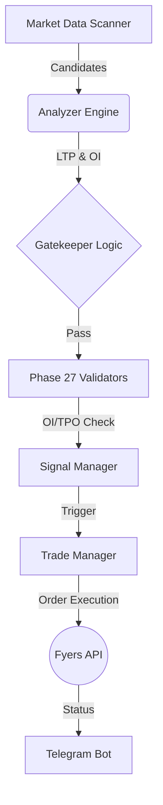

# ⚡ ShortCircuit: Institutional Grade Algo-Trading System


## 🎯 Overview

**ShortCircuit** is a high-performance, institutional-grade quantitative trading system designed for the Indian Equities market (NSE). Unlike traditional retail bots that rely on lagging indicators (RSI/MACD), ShortCircuit leverages **Auction Market Theory**, **Order Flow Analysis**, and **Market Profile (TPO)** to identify structural imbalances and institutional exhaustions.

The system is engineered for **Capital Preservation First**, acting as a "Sniper" ensuring only A+ setups with statistical edge are executed.

---

## ✨ Key Features

| Feature | Description |
| :--- | :--- |
| **🧠 Institutional Logic** | Integrates **Open Interest (OI) Divergence**, **Developing POC (dPOC)**, and **Volume Vacuums** to filter fakeouts. |
| **🛡️ 6-Gate Safety** | Every trade must pass 6 strict filters: Regiment, Time, Signal Cap, HTF Confluence, Extension, and Momentum. |
| **⚡ Circuit Guard** | Real-time **Upper Circuit Protection** blocks trades if price gets within 1.5% of the freeze limit. |
| **📉 Dynamic Risk** | Uses **ATR-based Volatility Stops** and **Dynamic Tick Sizing** to adjust risk per trade automatically. |
| **🖥️ Tape Reading** | internal **DOM (Depth of Market)** analyzer detects "Iceberg Orders", "Walls", and "Absorption" in real-time. |
| **🚨 Emergency Protocol** | "Army Grade" failsafes including **Auto-Square Off**, **Strike Limiters**, and **Loop Crash Recovery**. |

---

## 🏗️ Architecture

The system follows a modular, event-driven architecture optimized for speed and stability.



---

## 🚀 Strategy: "The Sniper"

We do not scalp for pennies. We hunt for **Structural Reversals**.

### The Setup
1.  **Extension**: Price must be > +2 Standard Deviations from VWAP.
2.  **Structure**: Look for **Shooting Star** or **Bearish Engulfing** at Day Highs.
3.  **Confirmation (Phase 27)**:
    *   **OI Divergence**: Price ⬆️ + OI ⬇️ (Short Covering Fakeout).
    *   **Value Div**: Price > POC + 1% (Value Stuck).
    *   **Vacuum**: Low Volume Rejection at Highs.

For full details, read the [Strategy Manual](Strategy.md).

---

## 🛠️ Installation

### Prerequisites
- Python 3.10+
- Fyers API V3 Access Token

### Setup
```bash
# 1. Clone the repository
git clone https://github.com/nabrahma/ShortCircuit.git

# 2. Install Dependencies
pip install -r requirements.txt

# 3. Configure API
# Edit config.py with your credentials
```

### Usage
```bash
# Run the Bot
python main.py
```

---

## 📊 Performance & Logs

All signals are logged to `logs/signals.csv` for forensic analysis.
- **Win Rate Target**: > 65%
- **Risk:Reward**: 1:2 Minimum

---

## ⚠️ Disclaimer

*Quantitative trading involves significant financial risk. This software is provided for educational and research purposes only. Use at your own risk.*

---
*Built with ⚡ by Nabaskar*
