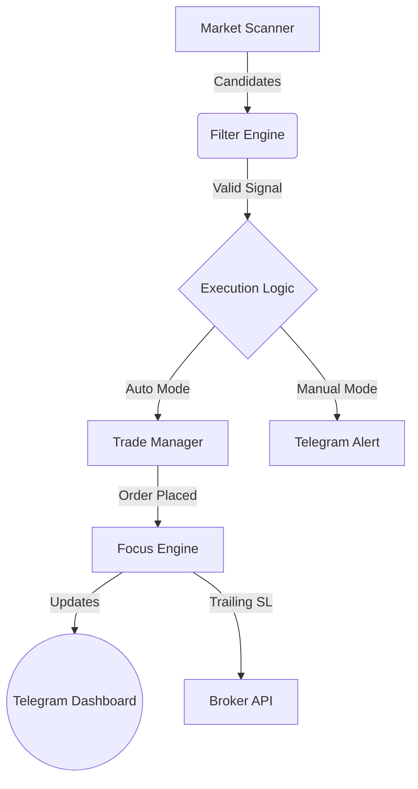

# ⚡ ShortCircuit (SC-Quant)

[](https://python.org)
[](LICENSE)
[-orange?style=for-the-badge)](https://www.nseindia.com)
[](#)

> **"The goal of a successful trader is to make the best trades. Money is secondary."** — *Alexander Elder*

ShortCircuit is an institutional-grade algorithmic trading engine engineered for the **Indian Equity Markets (NSE)**. Built on the **Fyers APIv3**, it synthesizes **Market Microstructure**, **Auction Market Theory**, and **Statistical Mean Reversion** to execute high-probability intraday setups with sub-second latency.

Unlike basic indicator-based bots, ShortCircuit is a **"Glass Box"** system—providing full transparency into its decision-making process via a real-time Telegram dashboard.

---

## 🏗️ Architecture

The system follows a modular, multi-threaded event-driven architecture designed for fault tolerance and speed.



### Core Modules
| Module | Role | Description |
| :--- | :--- | :--- |
| **Scanner** | `scanner.py` | Scans 2000+ stocks/min for Volume/Momentum anomalies & Microstructure health (Gaps/Dojis). |
| **Brain** | `analyzer.py` | Implementation of the "Sniper" Strategy. Applies the 6-Gate Filter Funnel. |
| **Executor** | `trade_manager.py` | Handles Order Sizing, Limit Order placement, and Stop Loss rounding (0.05 tick). |
| **Focus Engine** | `focus_engine.py` | Dedicated thread per trade. Manages P&L, Trailing Stops, and Tape Reading. |
| **Interface** | `telegram_bot.py` | Bi-directional control center. Accepts commands (`/stop`, `/auto`) and broadcasts logs. |

---

## 🦅 Strategy: "The Sniper"
The engine implements a rigorous Trend-Following system designed to capture large intraday moves (1:3+ Risk/Reward) while filtering out noise.

### The 6-Gate Verification Funnel
Every signal must pass **all** checks before execution:
1.  **Regime Filter:** Blocks Counter-Trend trades (e.g., Shorting when Nifty is Trend-Up).
2.  **Time Protection:** Blocks trading during High Volatility (09:15-10:00) and Lunch Chop (12:00-13:00).
3.  **HTF Confluence:** Verifies structure on the **15-Minute** timeframe (Lower Highs required).
4.  **VWAP Extension:** Only initiates trades when price is statistically overextended (>2 SD from VWAP).
5.  **Microstructure Health:** Rejects "Zombie Charts" (stocks with >30% zero-volume/flat candles).
6.  **Key Levels:** Prioritizes setups at Day High (PDH) or Week High (PWH).

### 🔬 Auction Market Theory (AMT)
ShortCircuit doesn't just look at candles; it processes the **Auction Logic**:
*   **Absorption:** Detects Iceberg Orders (Aggressive Buying vs Passive Selling).
*   **Exhaustion:** Identifies Volume dry-up at new highs.
*   **Delta Divergence:** Spots reversals where Price makes a High but Net Delta falls.

---

## ✨ Levels of Automation
ShortCircuit is designed as a **"Pilot-Assist"** system. It handles high-speed complexity while the human stays in command.

### ✅ Fully Autonomous (The "Bot")
*   **Scanning & Filtering:** 100% Automated.
*   **Execution:** Calculates Size, Places Entry, Places Stop Loss (Hard Limit).
*   **Risk Management:** Aborts if Entry fails (No Naked Positions).
*   **Trade Management:** Auto-trails Stop Loss to Breakeven (1:1) and locks profit (1:2).

### ✋ Manual Control (The "Human")
*   **Strategy Selection:** "Sniper" Strategy is hard-coded for consistency.
*   **Authentication:** Daily Fyers Login (OTP) is manual for security.
*   **Kill Switch:** Emergency Close via Telegram button.

---

## 🚀 Getting Started

### Prerequisites
*   Python 3.9+
*   Fyers API Account (with App Created)
*   Telegram Bot Token

### Installation
1.  **Clone the Repository**
    ```bash
    git clone https://github.com/nabrahma/ShortCircuit.git
    cd ShortCircuit
    ```

2.  **Install Dependencies**
    ```bash
    pip install -r requirements.txt
    ```

3.  **Configuration**
    Create a `.env` file in the root directory:
    ```env
    FYERS_CLIENT_ID=your_client_id
    FYERS_SECRET_ID=your_secret_id
    FYERS_REDIRECT_URI=https://trade.fyers.in/api-login/redirect-uri/index.html
    TELEGRAM_BOT_TOKEN=your_bot_token
    TELEGRAM_CHAT_ID=your_chat_id
    CAPITAL=2000 # Capital per trade
    ```

4.  **Run the Engine**
    ```bash
    python main.py
    ```

---

## 🤝 Contributing
Contributions are what make the open source community such an amazing place to learn, inspire, and create. Any contributions you make are **greatly appreciated**.

1.  Fork the Project
2.  Create your Feature Branch (`git checkout -b feature/AmazingFeature`)
3.  Commit your Changes (`git commit -m 'Add some AmazingFeature'`)
4.  Push to the Branch (`git push origin feature/AmazingFeature`)
5.  Open a Pull Request

---

## ⚠️ Disclaimer
**Use at your own risk.** Algorithmic trading involves significant financial risk.
*   This software is for educational purposes only.
*   The authors are not responsible for any financial losses incurred.
*   Always test in a controlled environment with small capital before scaling.

---

## 📜 License
Distributed under the Apache 2.0 License. See `LICENSE` for more information.

---

<p align="center">
  
</p>
